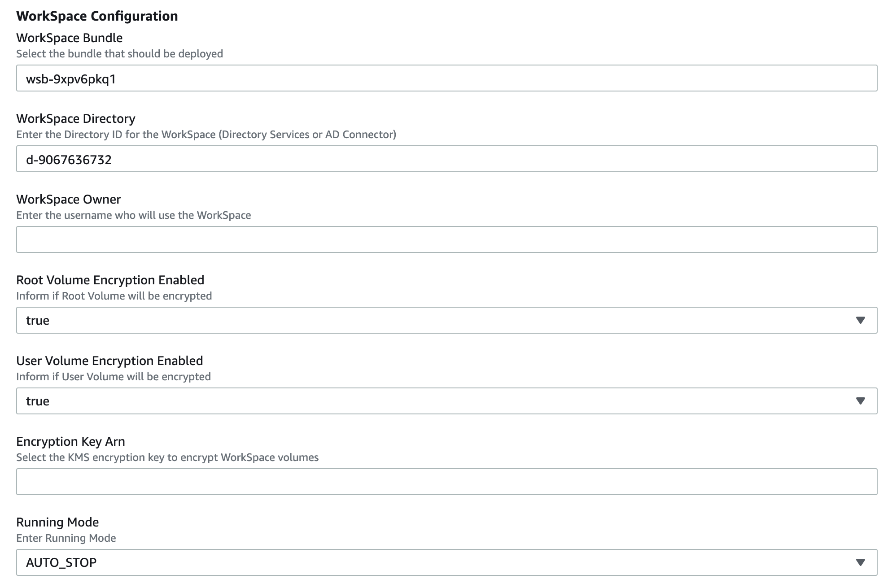

# Provision new AWS Workspace through CloudFormation template

### The main goal of this template is to provision a workspace to a AWS Directory Services user (AD Connector / Managed AD / Simple AD).

### Pre-Requirements
#### - It is mandatory to have AWS Directory Service (AD Connector or Managed AD or Simple AD) configured in AWS account.

### This template requires to fill the parameters below:

**- WorkSpace Bundle (Bundle identification) -** This default is a format sample of bundle identification (must be changed) 

**- WorkSpace Directory (AD Connector / Managed AD / Simple AD DirectoryId) -** This default is a format sample of DirectoryId (must be changed)

**- WorkSpace Owner (login user of this domain)**

**- Root Volume Encryption Enabled (True ou False)**

**- User Volume Encryption Enabled (True ou False)**

**- Encryption Key ARN (Encryption key ARN to be used to encrypt Root Volume and/or User Volume)**

**- Running Mode (ALWAYS_ON ou AUTO_STOP)** 

## Security

See [CONTRIBUTING](CONTRIBUTING.md#security-issue-notifications) for more information.

## License

This library is licensed under the MIT-0 License. See the LICENSE file.

